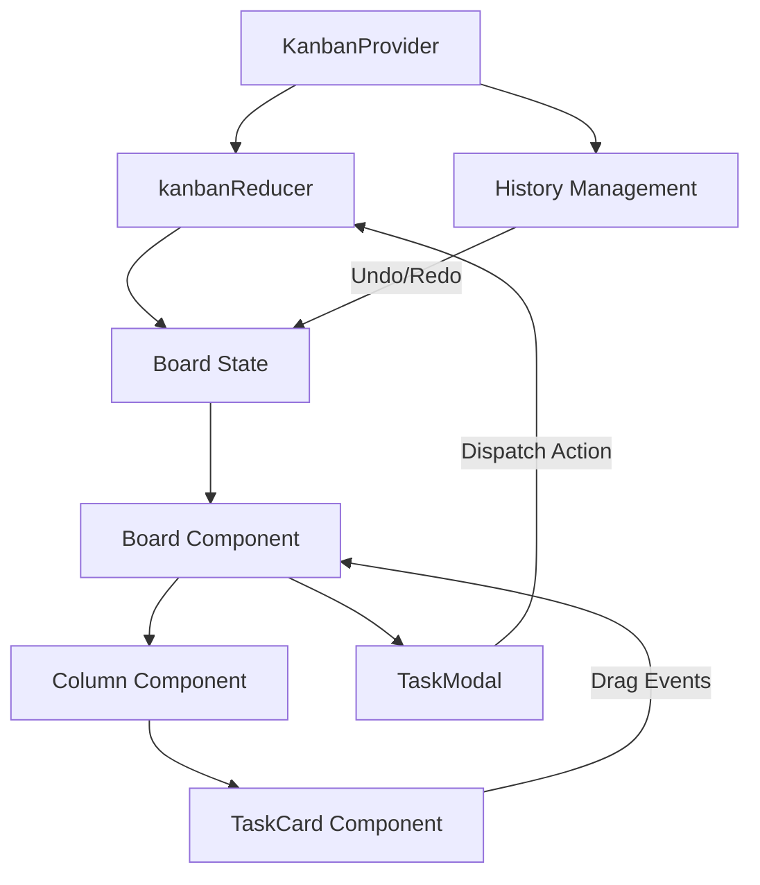

# 🧞 FlowForce Kanban

FlowForce is a premium, high-performance Kanban board application designed for professional workflows. Featuring a modern Glassmorphism UI and robust state management, it provides a seamless and productive experience for managing tasks and projects.

 *(Placeholder for screenshot)*

## ✨ Features

- **🎨 Modern Glassmorphism UI**: A premium visual design built with Tailwind CSS v4, featuring sleek transparency effects and HSL/OKLCH color palettes.
- **🧠 Advanced State Management**: 
    - Full Undo/Redo support (Ctrl+Z / Ctrl+Shift+Z) using the Command Pattern.
    - Automatic persistence to `localStorage` for seamless session recovery.
- **🛠️ Workflow Optimizations**:
    - **Board & List Views**: Instant toggle between a classic Kanban board and a compact table list view.
    - **WIP Limits**: Visual warnings when columns exceed their work-in-progress limits.
    - **Live Search**: Instant task filtering by pressing `/`.
    - **Bulk Actions**: Multi-select tasks (Ctrl+Click) for batch move or delete operations.
- **📋 Rich Task Management**: 
    - **Activity Timeline**: Full audit log of task changes and comments in a chronological feed.
    - **Checklists**: Multi-level task completion tracking with real-time progress bars.
    - **Sub-tasks**: Hierarchical task relationships.
    - **Priority & Tags**: Granular task classification and visual indicators.
- **📤 Data Portability**: Full JSON Export and Import capabilities for board backups and transfers.
- **🚀 High Performance**: Built with React 19 and Vite, utilizing memoization for buttery-smooth interactions.

## 🛠️ Tech Stack

- **Frontend**: [React 19](https://react.dev/) (TypeScript), [Tailwind CSS v4](https://tailwindcss.com/), [Framer Motion](https://www.framer.com/motion/), [@hello-pangea/dnd](https://github.com/hello-pangea/dnd)
- **Backend**: [NestJS](https://nestjs.com/), [Prisma ORM](https://www.prisma.io/), [Passport JWT](http://www.passportjs.org/)
- **Database**: [PostgreSQL](https://www.postgresql.org/) (Docker)
- **State Management**: React Context API + `useReducer` (with backend sync)
- **Build Tool**: [Vite](https://vitejs.dev/)

## 🚀 Getting Started

### Prerequisites

- [Node.js](https://nodejs.org/) (Latest LTS recommended)
- [Docker Desktop](https://www.docker.com/) (for PostgreSQL)
- [npm](https://www.npmjs.com/) or [yarn](https://yarnpkg.com/)

### Installation & Setup

1. Clone the repository:
   ```bash
   git clone https://github.com/kkim025/flowforce-kanban.git
   cd flowforce-kanban
   ```

2. **Install all dependencies**:
   Run this from the root directory to install dependencies for the root, API, and Web projects:
   ```bash
   npm run install-all
   ```

3. **Start the Database**:
   ```bash
   cd api
   docker-compose up -d
   cd ..
   ```

4. **Set up the Backend**:
   ```bash
   cd api
   cp .env.example .env    # Create environment file (Ensure DATABASE_URL and JWT_SECRET are set)
   npx prisma migrate dev  # Apply migrations and sync database schema
   npx prisma generate     # Generate Prisma Client
   cd ..
   ```

5. **Run the Application**:
   You can now start both the API and Web frontend concurrently from the root:
   ```bash
   npm run dev
   ```
   - API will run on `http://localhost:3000`
   - Web app will run on `http://localhost:5173`

### Testing

FlowForce uses a centralized testing strategy. You can run all tests (API & Web) from the root directory:

```bash
# Using npm
npm test

# Or using the specialized scripts
./test-all.sh      # Linux/macOS
.\test-all.ps1     # Windows (PowerShell)
```

#### Why this approach?
- **Centralization**: A single command from the root ensures all layers of the application are validated without navigating subdirectories.
- **Cross-Platform Support**: We provide both `.sh` and `.ps1` scripts to ensure a consistent experience across Windows, macOS, and Linux.
- **CI/CD Ready**: The root `package.json` scripts are optimized for CI environments (e.g., using `--run` for Vitest to prevent hanging).
- **Project Integrity**: Running both test suites together helps catch integration issues early and ensures that changes in the API/Types don't break the frontend.

## 🏗️ Architecture

FlowForce follows a **Unidirectional Data Flow** architecture with a command-history layer for robust Undo/Redo functionality.



- **History Management**: Every state change (MOVE, ADD, UPDATE, DELETE) is captured in a history stack (`past`, `present`, `future`).
- **Persistence**: The state is automatically mirrored to `localStorage` on every change.

## ⌨️ Global Shortcuts

| Shortcut | Action |
| :--- | :--- |
| `Ctrl + Z` | Undo last action |
| `Ctrl + Shift + Z` / `Ctrl + Y` | Redo action |
| `n` | Create new task |
| `/` | Focus search bar |
| `Ctrl + Click` | Multi-select tasks for bulk actions |

## 📂 Project Structure

```text
flowforce-kanban
├── api/                   # NestJS Backend Application
│   ├── src/
│   │   ├── auth/          # Authentication logic (JWT, Local)
│   │   ├── modules/       # Domain modules (Boards, Columns, Tasks, Users)
│   │   └── common/        # Shared decorators, Prisma service, DDD base classes
│   └── prisma/            # Database schema and migrations
├── web/                   # React/Vite Frontend Application
│   ├── src/
│   │   ├── components/    # UI Components (Board, ListView, TaskViewer)
│   │   ├── store/         # State Management (Context, Reducers)
│   │   ├── lib/           # Utilities and API client
│   │   └── types/         # TypeScript definitions
│   └── vite.config.ts
├── package.json           # Root workspace configuration
├── test-all.sh            # Universal test script (Linux/macOS)
└── test-all.ps1           # Universal test script (Windows)
```

## 📄 License

This project is licensed under the MIT License - see the LICENSE file for details.
