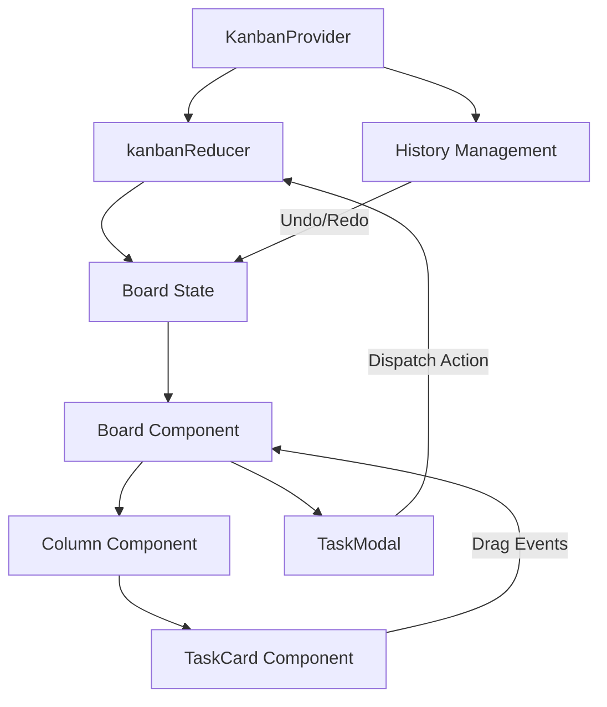

# 🧞 FlowForce Kanban

FlowForce is a full-stack Kanban board application built with NestJS, React, and PostgreSQL. It features a glassmorphism UI, real-time collaboration, sprints, time tracking, per-board wikis, undo/redo, and vim-style keyboard navigation.

 *(Placeholder for screenshot)*

## ✨ Features

### Boards & Tasks
- **Board & List Views**: Instant toggle between a classic Kanban board and a compact table list view.
- **WIP Limits**: Visual warnings when columns exceed their work-in-progress limits.
- **Drag-to-scroll**: Smoothly scroll horizontally while dragging cards across columns.
- **Multi-board support**: Create and switch between multiple boards from a single account.
- **Sub-tasks**: Hierarchical task relationships with dedicated popovers.
- **Checklists**: Multi-level task completion tracking with real-time progress bars.
- **Priority & Tags**: Granular task classification and visual indicators.
- **Due dates**: Per-task deadlines with reminder notifications.
- **Markdown descriptions**: Rich task descriptions rendered with `react-markdown`, sanitized via `rehype-sanitize`, with GFM support (`remark-gfm`).
- **JSON Import / Export**: Full board backups and transfers.

### Workflow
- **Sprints**: Create, activate, archive, and switch sprints per board; assign tasks to a sprint.
- **Time tracking**: Log time entries against tasks with start/stop and manual entry.
- **Sprint reports**: Estimated vs. logged variance per sprint, surfaced in a dedicated reports view.
- **Live search**: Instant task filtering by pressing `/`.
- **Advanced filters**: Filter tasks by assignee, priority, and tag.
- **Due-date filter**: Quickly find tasks due soon or overdue.

### Collaboration
- **Real-time notifications**: Socket.IO gateway (`api/src/modules/notifications`) pushes events to the frontend `NotificationsContext`.
- **@mention parsing**: `@user` mentions in comments generate notifications for the mentioned user.
- **Due-date reminder scanner**: Scheduled job fires notifications at 24h, 1h, and on overdue.
- **Per-type notification preferences**: Each user can opt in/out per notification type.
- **Board sharing**: Invite teammates to a board by email with role tiers (`VIEWER` / `EDITOR` / `ADMIN`).

### Wiki & Docs
- **Per-board wiki**: Hierarchical page tree scoped to each board.
- **Markdown pages**: Wiki pages rendered with sanitized markdown.
- **Page trash & restore**: Soft-delete with restore support.
- **Version history**: Track and review prior versions of a page.
- **Breadcrumbs**: Navigate the page hierarchy from any wiki page.

### Team & Admin
- **Multi-select bulk actions**: Ctrl+Click to select multiple tasks for batch move or delete.
- **Undo / Redo**: Full command-pattern-based history (Ctrl+Z / Ctrl+Shift+Z) for board operations.
- **Admin user management**: Invite users, change roles, and delete accounts.

### Auth & Session
- **JWT auth**: 8h token TTL, refresh on login.
- **Soft-logout on 401**: Expired tokens trigger a non-disruptive logout with a toast notification.
- **Vim-style keyboard navigation**: `j`/`k`/arrows + Enter/Escape for keyboard-driven task navigation.

## 🎨 UI

- **Glassmorphism design**: Sleek transparency effects built with Tailwind CSS v4, using HSL/OKLCH color palettes.
- **Smooth animations**: Powered by Framer Motion.
- **High performance**: Built with React 19 and Vite 7, with memoization for buttery-smooth interactions.

## 🛠️ Tech Stack

- **Frontend**: [React 19](https://react.dev/), [TypeScript 5](https://www.typescriptlang.org/), [Tailwind CSS v4](https://tailwindcss.com/), [Framer Motion](https://www.framer.com/motion/), [@hello-pangea/dnd](https://github.com/hello-pangea/dnd), [React Router v7](https://reactrouter.com/), [TanStack Query](https://tanstack.com/query), [`socket.io-client`](https://socket.io/), [`react-markdown`](https://github.com/remarkjs/react-markdown) + [`rehype-sanitize`](https://github.com/rehypejs/rehype-sanitize) + [`remark-gfm`](https://github.com/remarkjs/remark-gfm), [lucide-react](https://lucide.dev/)
- **Backend**: [NestJS 11](https://nestjs.com/), [Prisma 7](https://www.prisma.io/), [Passport JWT](http://www.passportjs.org/), [class-validator](https://github.com/typestack/class-validator), [Socket.IO gateway](https://socket.io/)
- **Database**: [PostgreSQL 15](https://www.postgresql.org/) (Docker)
- **State**: React Context + `useReducer`, augmented by TanStack Query for server state.
- **Build & Test**: [Vite 7](https://vitejs.dev/), [Vitest 4](https://vitest.dev/) + [jsdom](https://github.com/jsdom/jsdom) + [Testing Library](https://testing-library.com/), [Jest 30](https://jestjs.io/), TypeScript 5.

## 🚀 Getting Started

### Prerequisites

- [Node.js](https://nodejs.org/) **20+** (the CI workflow uses Node 22)
- [Docker Desktop](https://www.docker.com/) (for the PostgreSQL dev container)
- [npm](https://www.npmjs.com/)

### Installation & Setup

1. **Clone the repository**:
   ```bash
   git clone https://github.com/kkim025/flowforce-kanban.git
   cd flowforce-kanban
   ```

2. **Install all dependencies** (root + API + web):
   ```bash
   npm run install-all
   ```

3. **Start the PostgreSQL database** (PostgreSQL 15 Alpine, defined in `api/docker-compose.yml`):
   ```bash
   docker compose -f api/docker-compose.yml up -d
   ```
   Default dev credentials: user `postgres`, password `password`, database `flowforce`, port `5432`.

4. **Configure the backend** — copy the example env and set `DATABASE_URL` + `JWT_SECRET`:
   ```bash
   cp api/.env.example api/.env
   # Edit api/.env to set DATABASE_URL and JWT_SECRET
   npx prisma migrate dev   # Apply migrations and sync the database schema
   npx prisma generate      # Generate the Prisma Client
   ```

5. **Configure the frontend** — point it at the API:
   ```bash
   cp web/.env.example web/.env
   # Defaults to VITE_API_URL=http://localhost:5000
   ```

6. **Run the application** — both API and web start concurrently from the root:
   ```bash
   npm run dev
   ```
   - API will run on `http://localhost:5000` (matches `api/.env.example` and `web/.env.example`)
   - Web app will run on `http://localhost:5173`

### Testing

FlowForce uses a centralized testing strategy. You can run all tests (API & Web) from the root directory:

```bash
# Centralized: runs API Jest tests then web Vitest
npm test

# Or run a single suite
npm run test:api
npm run test:web

# Or use the cross-platform wrapper scripts
./test-all.sh      # Linux/macOS
.\test-all.ps1     # Windows (PowerShell)
```

#### Test Counts
- **API**: ~263 tests (Jest)
- **Web**: ~169 tests (Vitest)

#### Testing Architecture
- **Root**: `npm test` runs API first, then web (Vitest with `--run` to prevent hanging in CI).
- **Backend (API)**: [Jest 30](https://jestjs.io/) unit + e2e tests.
- **Frontend (Web)**: [Vitest 4](https://vitest.dev/) + [jsdom](https://github.com/jsdom/jsdom) + [React Testing Library](https://testing-library.com/).

#### Key Test Suites
- `api/test/unit/modules/checklists/checklists.service.spec.ts` — ownership and deletion logic.
- `web/src/store/KanbanContext.test.tsx` — kanban state transitions.
- `web/src/store/AuthContext.test.tsx` — auth lifecycle (load → pre-expiry warning → 401 soft-logout → manual logout).
- `web/src/store/NotificationsContext.test.tsx` — real-time notification handling.
- `web/src/components/Drawer.test.tsx` — UI interactions.
- `web/src/components/TaskViewer.test.tsx` — inline editing, status dropdown, comments.
- `web/src/components/TaskEditor.test.tsx` — create/edit mode, save/dispatch logic.
- `web/src/lib/utils.test.ts` — timeline sorting.

#### Why this approach?
- **Centralization**: A single command from the root ensures all layers of the application are validated without navigating subdirectories.
- **Cross-Platform Support**: We provide both `.sh` and `.ps1` scripts to ensure a consistent experience across Windows, macOS, and Linux.
- **CI/CD Ready**: The root `package.json` scripts are optimized for CI environments (e.g., using `--run` for Vitest to prevent hanging).
- **Project Integrity**: Running both test suites together helps catch integration issues early and ensures that changes in the API/Types don't break the frontend.

## 🔄 CI/CD

- **CI** (`.github/workflows/ci.yml`) runs on every PR and push to `development` and `main`:
  1. Spins up a `postgres:15-alpine` service container with a health check (`pg_isready -U postgres`).
  2. Sets `DATABASE_URL` and `JWT_SECRET` env vars and runs `npm run install-all`.
  3. Applies Prisma migrations (`npx prisma migrate deploy`) and generates the client.
  4. Runs `npm run lint` → `npm test` → `npm run build`.
- **Deploy** (`.github/workflows/deploy.yml`) runs on push to `main`. It builds artifacts and prints a placeholder `Deploy step` echo. **This is currently a stub** — wire it to real infrastructure (SSH, cloud provider, container registry, etc.) in a follow-up task.

## 🌿 Branch & PR Workflow

1. **Branch from `development`** (not `main`). Naming convention: `feature/<short-name>`.
   - Examples already in the repo: `feature/keyboard-navigation`, `feature/notifications`, `feature/multi-board-support`.
2. Develop and commit on your feature branch.
3. **Open a PR back to `development`** when the feature is ready. Paul reviews and merges.
4. Releases flow `development` → `main`. `main` is what `deploy.yml` deploys from.

```
development ──► feature/your-feature ──PR─► development ──► main
```

See [`roadmap.md`](roadmap.md) for the full developer guide.

## 🏗️ Architecture

FlowForce follows a **Unidirectional Data Flow** architecture with a command-history layer for robust Undo/Redo functionality.



- **History Management**: Every state change (MOVE, ADD, UPDATE, DELETE) is captured in a history stack (`past`, `present`, `future`).
- **Persistence**: The state is automatically mirrored to `localStorage` on every change.
- **Real-time gateway**: `api/src/modules/notifications` runs a [Socket.IO](https://socket.io/) gateway that pushes events (mentions, due-date reminders, etc.) to the frontend `NotificationsContext`, which subscribes via `web/src/lib/socket.ts`.
- **Auth lifecycle**: A 4-stage flow runs in `AuthContext` and `useTokenExpiryWarning` — initial token load → pre-expiry warning → 401 soft-logout (toast) → manual logout. See [`docs/references/frontend-state.md`](docs/references/frontend-state.md) for the full state diagram.

## ⌨️ Global Shortcuts

| Shortcut | Action |
| :--- | :--- |
| `Ctrl + Z` | Undo last action |
| `Ctrl + Shift + Z` / `Ctrl + Y` | Redo action |
| `n` | Create new task |
| `/` | Focus search bar |
| `Ctrl + Click` | Multi-select tasks for bulk actions |
| `j` / `k` | Move card focus down/up (vim-style) |
| `←` / `→` | Move focus to previous/next column |
| `Enter` | Open the focused task |
| `Escape` | Close the task drawer |

## 📂 Project Structure

```text
flowforce-kanban
├── .github/workflows/    # CI (ci.yml) and Deploy (deploy.yml) pipelines
├── api/                   # NestJS Backend
│   ├── src/
│   │   ├── auth/          # JWT auth (8h TTL, soft-logout contract)
│   │   ├── modules/       # boards, columns, tasks, subtasks, checklists,
│   │   │                  #   sprints, time-entries, notifications,
│   │   │                  #   notification-prefs, board-sharing, users, wiki
│   │   ├── common/        # Shared decorators, Prisma service, DDD base classes
│   │   └── main.ts        # NestJS bootstrap (PORT env, default 3000)
│   ├── prisma/            # Database schema and migrations
│   ├── test/              # Jest unit + e2e tests
│   └── docker-compose.yml # PostgreSQL 15 dev database
├── web/                   # React/Vite Frontend
│   ├── src/
│   │   ├── components/    # UI by feature area
│   │   │                  #   (boards, sprints, wiki, notifications,
│   │   │                  #    time-tracking, reports, admin, common)
│   │   ├── store/         # KanbanContext, AuthContext, NotificationsContext, ...
│   │   ├── hooks/         # useKeyboardNavigation (vim-style nav)
│   │   ├── lib/           # api.ts, socket.ts, auth-events.ts, ...
│   │   └── types/         # TypeScript definitions
│   └── vite.config.ts
├── docs/                  # Project documentation (see docs/references/_INDEX.md)
├── package.json           # Root workspace configuration
├── test-all.sh / .ps1     # Cross-platform test runners
├── roadmap.md             # Developer workflow & branch strategy
├── GUIDELINES.md          # Behavioral guidelines for AI agents
└── CLAUDE.md              # Claude Code / AI agent guidance
```

## 📚 Additional Documentation

- [`docs/references/_INDEX.md`](docs/references/_INDEX.md) — reference docs (architecture, frontend state, API endpoints, database schema, development commands).
- [`roadmap.md`](roadmap.md) — branch workflow, quick-start, and developer guide.
- [`CLAUDE.md`](CLAUDE.md) / [`GUIDELINES.md`](GUIDELINES.md) — contributor and AI-agent rules.

## 📄 License

This project is licensed under the MIT License - see the LICENSE file for details.
