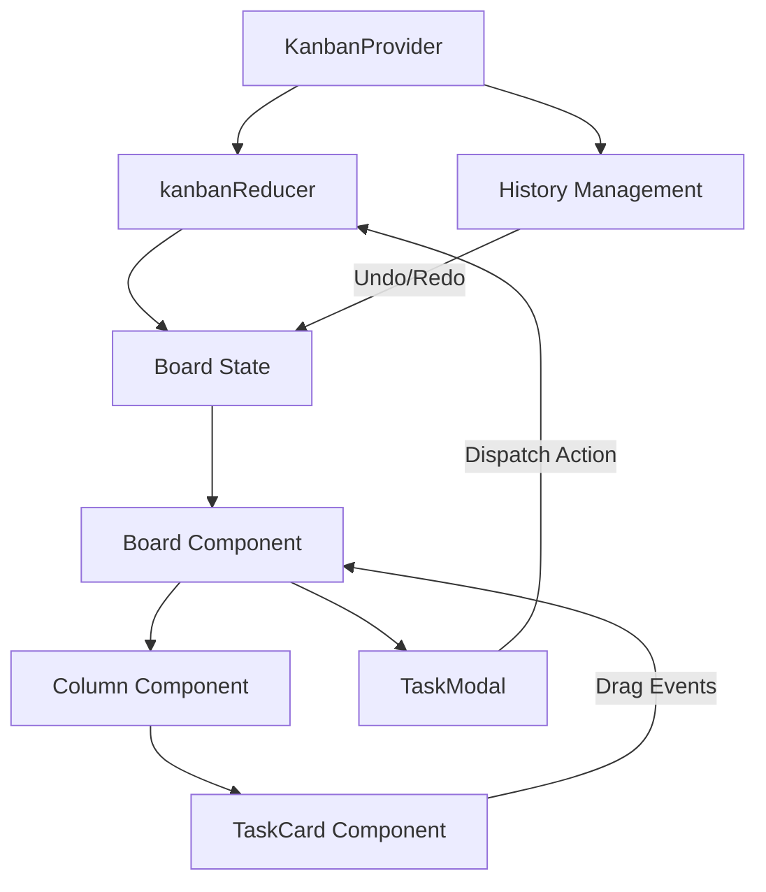

# 🧞 FlowForce Kanban

FlowForce is a premium, high-performance Kanban board application designed for professional workflows. Featuring a modern Glassmorphism UI and robust state management, it provides a seamless and productive experience for managing tasks and projects.

 *(Placeholder for screenshot)*

## ✨ Features

- **🎨 Modern Glassmorphism UI**: A premium visual design built with Tailwind CSS v4, featuring sleek transparency effects and HSL/OKLCH color palettes.
- **🧠 Advanced State Management**: 
    - Full Undo/Redo support (Ctrl+Z / Ctrl+Shift+Z) using the Command Pattern.
    - Automatic persistence to `localStorage` for seamless session recovery.
- **🛠️ Workflow Optimizations**:
    - **WIP Limits**: Visual warnings when columns exceed their work-in-progress limits.
    - **Live Search**: Instant task filtering by pressing `/`.
    - **Bulk Actions**: Multi-select tasks (Ctrl+Click) for batch move or delete operations.
- **📋 Rich Task Management**: 
    - Sub-tasks with real-time progress tracking.
    - Priority tagging and rich metadata.
- **📤 Data Portability**: Full JSON Export and Import capabilities for board backups and transfers.
- **🚀 High Performance**: Built with React 19 and Vite, utilizing memoization for buttery-smooth interactions.

## 🛠️ Tech Stack

- **Framework**: [React 19](https://react.dev/) (TypeScript)
- **Styling**: [Tailwind CSS v4](https://tailwindcss.com/)
- **Animations**: [Framer Motion](https://www.framer.com/motion/)
- **Drag & Drop**: [@hello-pangea/dnd](https://github.com/hello-pangea/dnd)
- **State Management**: React Context API + `useReducer`
- **Testing**: [Vitest](https://vitest.dev/) + React Testing Library
- **Build Tool**: [Vite](https://vitejs.dev/)

## 🚀 Getting Started

### Prerequisites

- [Node.js](https://nodejs.org/) (Latest LTS recommended)
- [npm](https://www.npmjs.com/) or [yarn](https://yarnpkg.com/)

### Installation

1. Clone the repository:
   ```bash
   git clone https://github.com/kkim025/flowforce-kanban.git
   cd flowforce-kanban
   ```

2. Navigate to the `web` directory and install dependencies:
   ```bash
   cd web
   npm install
   ```

### Development

Run the development server:
```bash
npm run dev
```
The application will be available at `http://localhost:5173`.

### Build

Create a production-ready build:
```bash
npm run build
```

### Testing

Run the test suite:
```bash
npm run test
```

## 🏗️ Architecture

FlowForce follows a **Unidirectional Data Flow** architecture with a command-history layer for robust Undo/Redo functionality.



- **History Management**: Every state change (MOVE, ADD, UPDATE, DELETE) is captured in a history stack (`past`, `present`, `future`).
- **Persistence**: The state is automatically mirrored to `localStorage` on every change.

## ⌨️ Global Shortcuts

Maximize your productivity with these built-in shortcuts:

| Shortcut | Action |
| :--- | :--- |
| `Ctrl + Z` | Undo last action |
| `Ctrl + Shift + Z` / `Ctrl + Y` | Redo action |
| `n` | Create new task |
| `/` | Focus search bar |
| `Ctrl + Click` | Multi-select tasks for bulk actions |

## 📂 Project Structure

```text
C:\Development\flowforce-kanban
├── web
│   ├── src
│   │   ├── components\    # UI Components (Board, Column, Card, Modal)
│   │   ├── store\         # State Management (Context, Reducer, History)
│   │   ├── types\         # TypeScript interfaces and types
│   │   ├── App.tsx        # Main application entry point
│   │   └── index.css      # Tailwind v4 styles
│   └── vite.config.ts     # Vite configuration
└── GEMINI.md              # Project documentation and context
```

## 📄 License

This project is licensed under the MIT License - see the LICENSE file for details.
